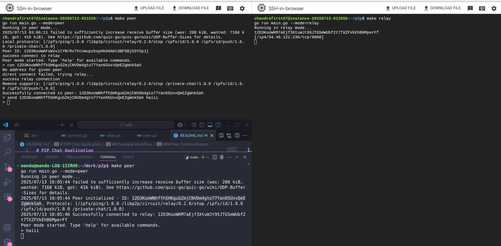

# P2P Chat Application

A decentralized peer-to-peer chat application built with libp2p that supports direct connections, relay connections, and DHT-based peer discovery. This application demonstrates advanced P2P networking concepts including NAT traversal, distributed hash tables, and circuit relay protocols.



## Features

- **Direct P2P Messaging**: Send messages directly between peers using custom protocol
- **Relay Support**: Fallback to relay connections when direct connections fail (NAT traversal)
- **DHT Discovery**: Discover peers using Kademlia DHT with automatic bootstrap
- **NAT Traversal**: Built-in hole punching and NAT port mapping for firewall bypass
- **Circuit Relay**: Support for relay nodes to facilitate connections between NAT'd peers
- **Peer Store**: In-memory peer management with address caching
- **CLI Interface**: Interactive command-line interface for peer operations
- **Auto-Reconnection**: Robust connection handling with fallback mechanisms

## Architecture

The application consists of several key components:

- **Peer Management**: Core peer functionality and host initialization
- **Chat Protocol**: Custom protocol for peer-to-peer messaging (`/private-chat/1.0.0`)
- **DHT Integration**: Kademlia DHT for peer discovery and routing
- **Relay System**: Circuit relay for NAT traversal
- **Peer Store**: In-memory storage for discovered peers

## Configuration

### Environment Variables

Create a `.env` file in the project root with the following configuration:

```bash
# Relay server configuration
RELAY_IP=99.0.0.5
RELAY_TCP_PORT=2222
RELAY_ID=12D3KooWExampleRelayPeerID...
```

### Configuration Parameters

- **RELAY_IP**: IP address of the relay server (publicly accessible)
- **RELAY_TCP_PORT**: TCP port for relay server
- **RELAY_ID**: Peer ID of the relay server (generated from relay's private key)

## Usage

### Running as a Relay Server

```bash
./p2p-chat --mode relay
```

### Running as a Peer

```bash
./p2p-chat --mode peer
```

## CLI Commands

Once running in peer mode, you can use the following commands:

### Key Management
- `genkey` - Generate a new Ed25519 private key (use this to derive peer IDs)
- `help` - Show all available commands

> **Note**: The `genkey` command generates the private key that determines your peer ID. Save this key securely as it represents your peer's identity on the network.

### Peer Discovery
- `dht` - Discover peers via DHT and advertise yourself
- `list` - List all discovered peers
- `find <peer_id>` - Find addresses for a specific peer

### Connection Management
- `ping <peer_id> <peer_addr>` - Test connectivity to a peer
- `con <peer_id>` - Connect to a peer (tries direct, falls back to relay)

### Messaging
- `send <peer_id> <message>` - Send a message to a connected peer

### System
- `exit` - Exit the application

## Example Workflow

### Initial Setup

1. **Generate keys for relay server**:
   ```bash
   ./p2p-chat --mode peer
   > genkey
   Generated key: CAESIBx7hGtQvnKCqGnNlLzKHgVXQZXPQ3vBJ6VGpJLGnNlZ
   ```
   Save this key `RELAY_ID` for your relay server configuration.

2. **Generate keys for peer**:
   ```bash
   ./p2p-chat --mode peer
   > genkey  
   Generated key: CAESIDy8iHuRwoMDrHoOmMmLKhgWYRZYQ4wCK7WHqKMHoOmM
   ```
   Save this key `PEER_ID` for your peer configuration.

3. **Set up relay server**:
   ```bash
   # Configure relay with generated key
   ./p2p-chat --mode relay
   ```

### Peer Communication

1. **Start a peer**:
   ```bash
   ./p2p-chat --mode peer
   Peer initialized - ID: 12D3KooWExamplePeerID, Protocols: [/private-chat/1.0.0]
   Successfully connected to relay: 12D3KooWExampleRelayID
   ```

2. **Discover peers via DHT**:
   ```
   > dht
   Successfully advertised. TTL: 24h0m0s
   Total found peers (excluding self): 3
   ```

3. **List discovered peers**:
   ```
   > list
   [12D3KooW... 12D3KooX... 12D3KooY...]
   ```

4. **Connect to a peer**:
   ```
   > con 12D3KooWExampleTargetPeer
   success direct connection
   Remote supports: [/private-chat/1.0.0 /libp2p/circuit/relay/0.2.0/hop]
   Successfully connected to peer: 12D3KooWExampleTargetPeer
   ```

5. **Send a message**:
   ```
   > send 12D3KooWExampleTargetPeer Hello, this is a test message!
   ```

6. **Receive messages**:
   ```
   Hello, this is a test message!
   ```

## Resources

- [libp2p Documentation](https://docs.libp2p.io/)
- [Kademlia DHT Specification](https://pdos.csail.mit.edu/~petar/papers/maymounkov-kademlia-lncs.pdf)
- [Circuit Relay Specification](https://github.com/libp2p/specs/tree/master/relay)